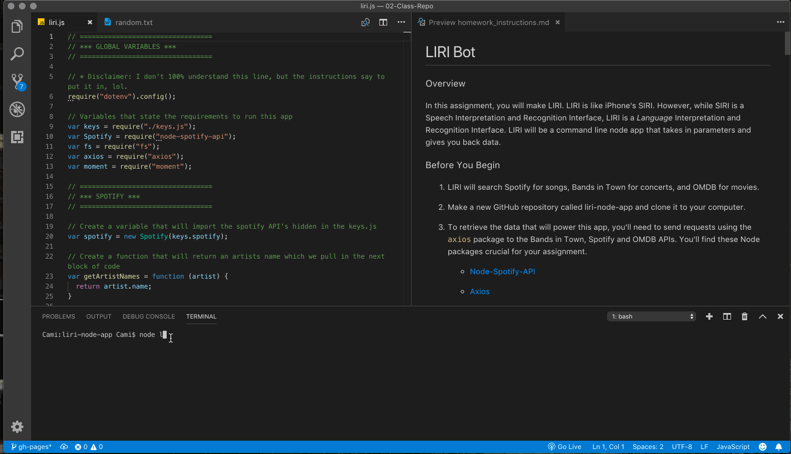

# LIRI Node App

In this assignment we created a 'SIRI' like app called 'LIRI' which will use language interpritation and recognition. Commands lines are taken in parameters to give you back the desired data.

> **Notes from Author:** To be honest, I had a much easier time in the first half of creating this app and only really struggled when it came to the switch statements and getting errors to work properly. Using the reference videos in the supplemental content, I was able to figure it out.

# Instructions

1. Use the terminal to install and run all commands.
2. Install the required Node packages by typing in this code:
`npm init -y`
3. To search for concerts by artist: `node liri.js concert-this <artist/band name here>`
     * Name of the venue
     * Venue location
     * Date and Time of Event
4. To search Spotify for a track: `node liri.js spotify-this-song '<song name here>'`
     * Artist(s)
     * The song's name
     * A preview link of the song from Spotify
     * The album that the song is from
5. To search OMDB for a movie: `node liri.js movie-this '<movie name here>'`
    * Title of the movie.
    * Year the movie came out.
    * IMDB Rating of the movie.
    * Rotten Tomatoes Rating of the movie.
    * Country where the movie was produced.
    * Language of the movie.
    * Plot of the movie.
    * Actors in the movie.
6. To run the random.txt file: `node liri.js do-what-it-says`

# Video Demo

# Node Packages
   * [Node-Spotify-API](https://www.npmjs.com/package/node-spotify-api)

   * [Axios](https://www.npmjs.com/package/axios)

     * [OMDB API](http://www.omdbapi.com)
     * [Bands In Town API](http://www.artists.bandsintown.com/bandsintown-api)

   * [Moment](https://www.npmjs.com/package/moment)

   * [DotEnv](https://www.npmjs.com/package/dotenv)